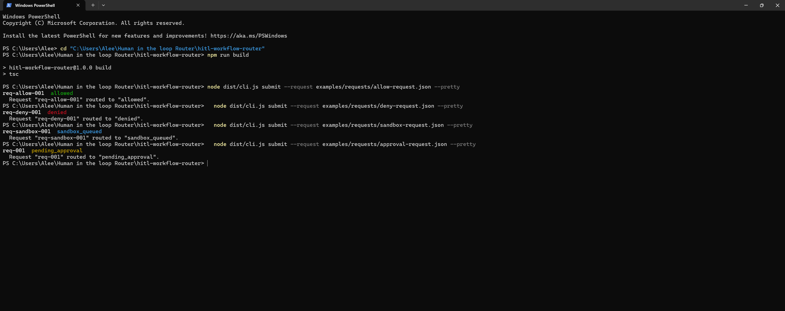
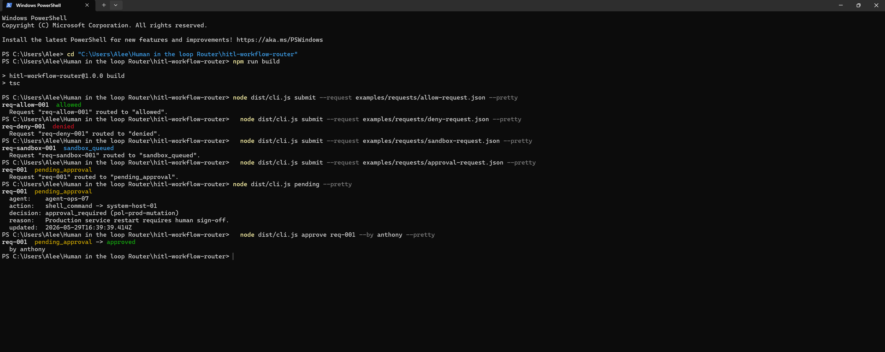
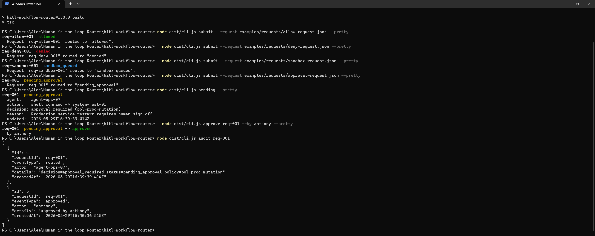
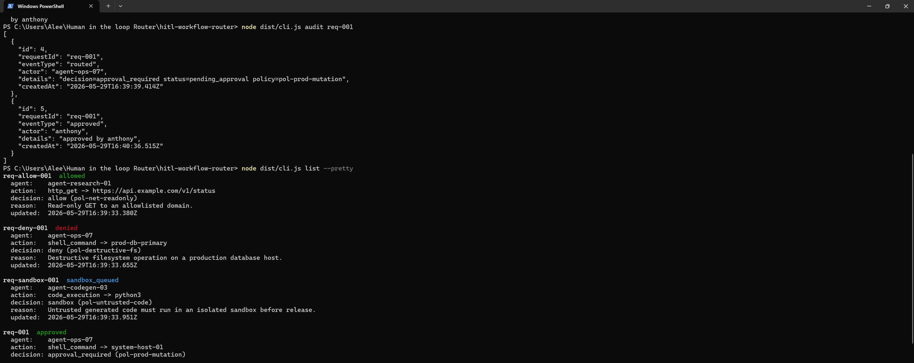
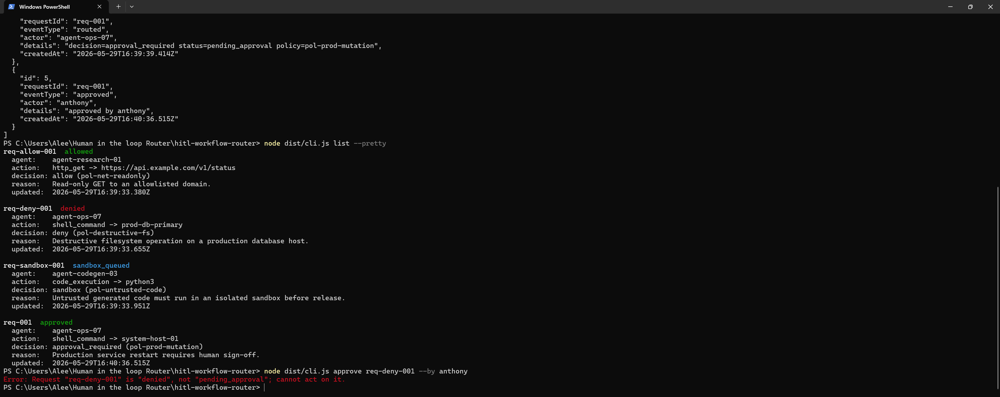

# Human-in-the-Loop Workflow Router

> A lightweight router that takes a **policy-decided** AI agent action and routes it
> into one of four operational paths — `allow`, `deny`, `sandbox`, or
> `approval_required` — while recording a complete, append-only audit trail.

[](https://nodejs.org)
[](https://www.typescriptlang.org/)
[](https://vitest.dev/)
[](./LICENSE)

---

## Demo

**Four policy decisions, four operational paths.** `allow → allowed`,
`deny → denied`, `sandbox → sandbox_queued`, `approval_required → pending_approval`:



**The human-in-the-loop gate.** A pending request is held until a human approves it
(`pending_approval → approved`):



**An append-only audit trail** for every request — who decided what, and when:



**The full board** via `list --pretty`:



**Guardrails hold.** You cannot approve a request that was already denied:



---

## Problem

Autonomous agents increasingly take real actions — running commands, calling APIs,
executing generated code. A policy engine can *decide* whether an action is safe,
but a decision is not enough on its own. Someone still has to:

- route the decision into the right operational path,
- pause risky actions for a human to approve or reject,
- and keep an immutable record of who decided what, and when.

Without that layer, "human-in-the-loop" is a slide-deck promise, not a system.

## Solution

This repo is the **routing and audit layer** that sits *after* policy evaluation and
*before* execution. It receives an agent action request that already contains a
`policyDecision`, routes it to a workflow status, persists the record and an audit
event in SQLite, and exposes approve/reject controls for the human-gated path.

It is intentionally small and deterministic. **It does not execute anything** — no
shell commands, no API calls, no agent actions. It routes and records.

## Current status

✅ **Working core, fully tested.**

- All four decision paths route correctly (`allow` / `deny` / `sandbox` / `approval_required`).
- Approve / reject flows enforce the status machine and write audit events.
- 10 passing Vitest unit tests; clean `tsc` build.
- CLI returns structured JSON by default, with `--pretty` for humans.

Not yet built: execution callbacks, HTTP service mode, notifier hooks (see
[docs/roadmap.md](./docs/roadmap.md)).

## Quick start

```bash
# Requires Node.js 22+
npm install
npm run build
npm test

# Route the four example requests
node dist/cli.js submit --request examples/requests/allow-request.json
node dist/cli.js submit --request examples/requests/deny-request.json
node dist/cli.js submit --request examples/requests/sandbox-request.json
node dist/cli.js submit --request examples/requests/approval-request.json

# Inspect and act on the human-gated request
node dist/cli.js pending --pretty
node dist/cli.js approve req-001 --by anthony
node dist/cli.js audit req-001
```

The SQLite database is created at `./data/hitl-router.db` by default. Override it
with the `DATABASE_PATH` environment variable (see [.env.example](./.env.example)).

> **Tip:** after `npm install`, the `hitl-router` bin is available, so
> `npx hitl-router list` works in place of `node dist/cli.js list`.

## Example request

A request is a policy *decision* plus the action it applies to
(`examples/requests/approval-request.json`):

```json
{
  "requestId": "req-001",
  "agentId": "agent-ops-07",
  "action": {
    "type": "shell_command",
    "target": "system-host-01",
    "parameters": { "command": "systemctl restart api-gateway" }
  },
  "policyDecision": {
    "decision": "approval_required",
    "policyId": "pol-prod-mutation",
    "reason": "Production service restart requires human sign-off.",
    "evaluatedAt": "2026-05-29T17:05:00.000Z"
  },
  "metadata": { "environment": "production", "severity": "high" }
}
```

The request is validated with [Zod](https://zod.dev/) before routing; malformed
input fails with a structured schema error and exit code `1`.

## Example output

`submit` returns a structured `RouteResult`:

```json
{
  "requestId": "req-001",
  "status": "pending_approval",
  "policyDecision": "approval_required",
  "routedAt": "2026-05-29T17:05:05.000Z",
  "message": "Request \"req-001\" routed to \"pending_approval\"."
}
```

After a human approves it, the audit trail (`audit req-001`) reads:

```json
[
  {
    "id": 1,
    "requestId": "req-001",
    "eventType": "routed",
    "actor": "agent-ops-07",
    "details": "decision=approval_required status=pending_approval policy=pol-prod-mutation",
    "createdAt": "2026-05-29T17:05:05.000Z"
  },
  {
    "id": 2,
    "requestId": "req-001",
    "eventType": "approved",
    "actor": "anthony",
    "details": "approved by anthony",
    "createdAt": "2026-05-29T17:06:30.000Z"
  }
]
```

More canned outputs live in [`examples/outputs/`](./examples/outputs).

## CLI commands

| Command | Description |
| --- | --- |
| `hitl-router submit --request <path>` | Validate and route a request from a JSON file. |
| `hitl-router list` | List all workflow records. |
| `hitl-router pending` | List records awaiting human approval. |
| `hitl-router approve <requestId> --by <actor>` | Approve a pending request. |
| `hitl-router reject <requestId> --by <actor> --reason <text>` | Reject a pending request. |
| `hitl-router audit <requestId>` | Show the full audit trail for a request. |

Every command prints structured JSON by default. Add `--pretty` for colorized,
human-readable output.

```bash
hitl-router reject req-001 --by anthony --reason "Command not needed."
```

## Architecture

```
CLI ─► WorkflowRouter ─► decision-router (decision → status)
                      └► SqliteStore (workflow_records)
                      └► AuditLog (audit_events)

CLI ─► ApprovalService ─► status-machine (assertTransition)
                       └► SqliteStore (update status)
                       └► AuditLog (audit_events)
```

- **Validation at the boundary** — Zod parses untrusted input before it touches the DB.
- **Deterministic core** — synchronous `better-sqlite3`; no async ordering surprises.
- **Append-only audit** — every route/approve/reject writes one immutable event.
- **Dependency injection** — services take a store, so tests run against `:memory:`.

Full detail in [docs/architecture.md](./docs/architecture.md).

## Workflow statuses

| Status | Meaning |
| --- | --- |
| `received` | Reserved pre-routing intake state (future use). |
| `allowed` | Policy allowed the action; cleared for execution. |
| `denied` | Policy denied the action; terminal. |
| `pending_approval` | Awaiting a human decision. |
| `approved` | A human approved a pending request. |
| `rejected` | A human rejected a pending request; terminal. |
| `sandbox_queued` | Routed to an isolated sandbox for execution. |
| `executed` | Reported complete by an external executor (future). |
| `failed` | Reported failed by an external executor (future). |

The decision → status mapping and the legal transitions are documented in
[docs/status-machine.md](./docs/status-machine.md).

## Relationship to Aegis / Agent Policy Engine / Witness

This router is one component of a larger secure-AI-workflow stack:

- **Agent Policy Engine** — *decides*. It evaluates a proposed agent action and emits
  the `policyDecision` (`allow` / `deny` / `sandbox` / `approval_required`) that this
  router consumes. The router never makes policy decisions itself.
- **Human-in-the-Loop Workflow Router** (this repo) — *routes and gates*. It turns a
  decision into a tracked workflow, holds risky actions for human approval, and
  records the trail.
- **Aegis Platform** — the *control plane*. Aegis orchestrates policy, routing, and
  execution end-to-end; this router is the human-gating + audit stage within it.
- **Witness** — the *verifier*. The append-only `audit_events` stream is designed to
  feed Witness for tamper-evident, externally verifiable records.

```
Agent ──► Agent Policy Engine ──► [ HITL Workflow Router ] ──► Execution Engine
                                          │
                                          └──► Witness (audit verification)
                         (all coordinated by the Aegis Platform)
```

## Non-goals

- **Not an execution engine.** It never runs shell commands, API calls, or agent
  actions. It records intent and routing only.
- **Not a policy engine.** It consumes decisions; it does not make them.
- **Not a general workflow orchestrator.** Scope is deliberately limited to routing
  policy decisions and gating human approvals.

## Roadmap

Execution callbacks, approval expiry, request signing, an HTTP service mode,
notifier hooks, pluggable storage, and Witness integration. See
[docs/roadmap.md](./docs/roadmap.md).

## Tech stack

TypeScript · Node.js 22+ · [Commander](https://github.com/tj/commander.js) ·
[Zod](https://zod.dev/) · [better-sqlite3](https://github.com/WiseLibs/better-sqlite3) ·
[Vitest](https://vitest.dev/) · [chalk](https://github.com/chalk/chalk)

## License

[MIT](./LICENSE)
